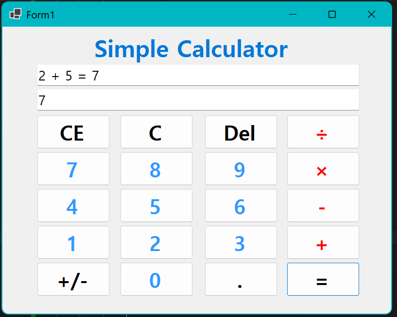
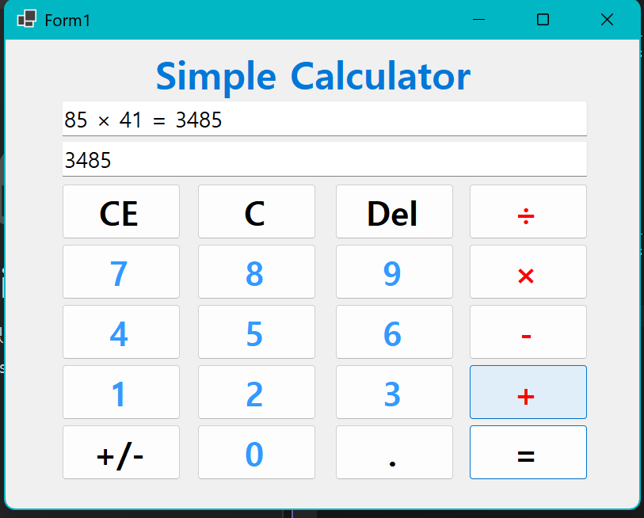
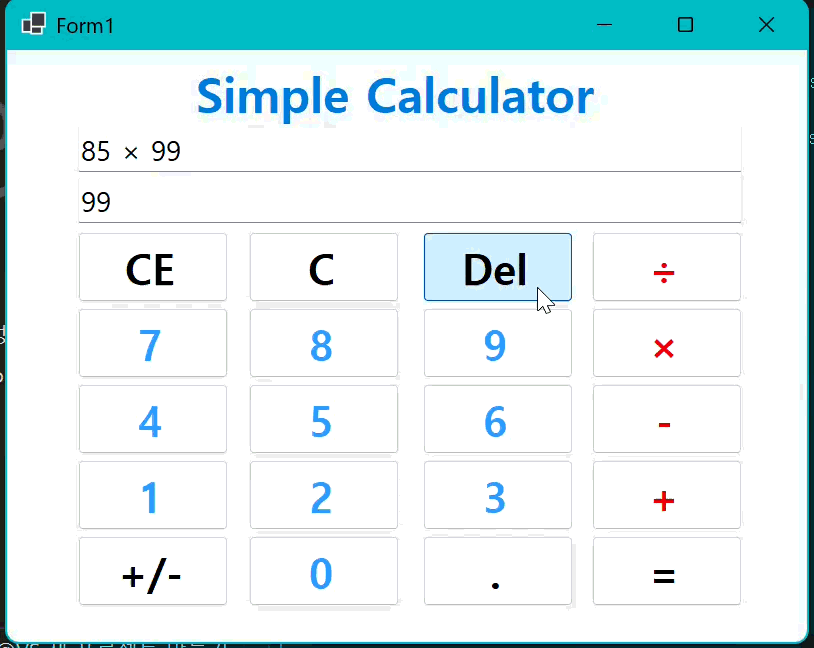

# (C# 코딩) 심플 사칙연산기

## 개요-C# 프로그래밍학습
- 1줄소개: 사용자키보드입력을받아서처리하는프로그램
- 사용한플랫폼: 
	- C#, .NET Windows Forms, Visual Studio, GitHub
- 사용한컨트롤:
	- Label, TextBox, Button
- 사용한기술과구현한기능:
	-Visual Studio를이용하여UI 디자인
	- int와 string 클래스로 자료형 전환 

- 수업중에배우고사용했던클래스들관련된설명
	-
	-
-실습중에구현한기능들설명
	-
	-

## 실행화면(과제1)
-과제1코드의실행스크린샷

- 과제내용
	- 컨트롤 배치와 기본적인 속성 설정
	- 입력 내용을 2가지 방법으로 표시하는 기능 구현
	- 계산기의 더하기 기능 구현

- 구현내용과기능설명
	- UI 구성 (TextBox, Button 배치)
	- 숫자 입력 기능 (숫자 Button 클릭시 TextBox에 표시)
	- 계산 및 출력 기능 (2개의 피연산자의 입력값을 Int로 변환후 계산 후 출력)

## 실행화면(과제2)
- 과제2코드의실행스크린샷

- 과제내용
	- 빼기, 곱하기, 나누기 구현

- 구현내용과기능설명
	- 과제 1의 더하기 기능을 참고해 나머지 사칙 연산 기능 추가
	- 0으로 나눌 경우에는 애러 출력

## 실행화면(과제3)
-과제3코드의실행스크린샷

- 과제내용
	- 계산기에 있는 수정/삭제 기능 추가

- 구현 내용과 기능설명
	- C 버튼 (모든 내용을 삭제 및 초기화)
	- CE 버튼 (마지막에 입력한 피연산자 값 삭제)
	- Del 버튼 (마지막에 입력한 숫자 하나 삭제)

## 실행화면(과제4)
-과제4코드의실행스크린샷
![과제4 실행화면] (img/screenshot-4.png)

- 과제내용
	- 
- 구현내용과기능설명
	- 